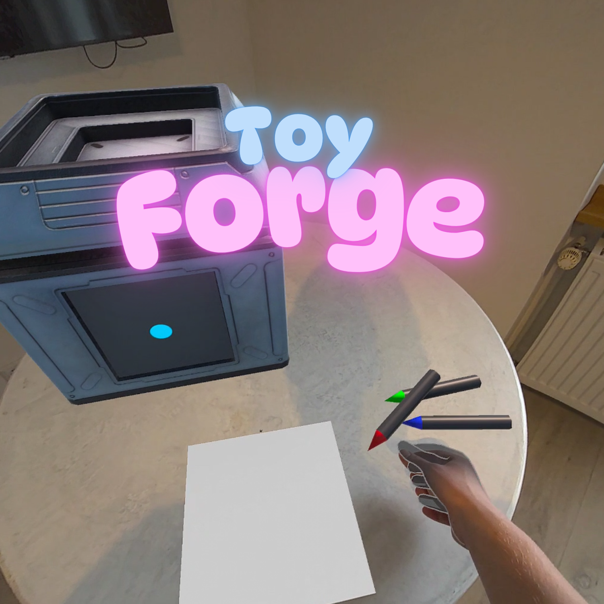

# Idea
Toy Forge is a VR prototype that uses AI to transform user-created 2D sketches into playful 3D toys. Users draw or upload a picture, which is scanned and processed by an AI pipeline to generate a matching toy model. The toy is then "built" inside a whimsical animated machine in VR and can be picked up, placed, and played with in the virtual space.
This project explores how AI and spatial computing can make digital creation feel tangible, magical, and personal—bridging imagination and interactivity.

# Trailer

# Features
## Core features
- Draw or Upload Sketch
Users can either draw in VR or upload a simple 2D image as input.
- AI-Powered 3D Generation
The sketch is enhanced using AI and converted into a 3D toy model.
- Animated Creation Machine
A custom machine in VR scans and "builds" the toy with visual feedback and anticipation.
- Toy Placement and Interaction
Finished toys can be removed from the machine and placed or played with in VR.

## Stretch goals
- Custom Texture Painting
Paint the toy’s surface using a dedicated coloring station.
- Toy Shelf
Store and display previously generated toys in a VR playroom.
- Toy Physics or Mini-Games
Add toy-based challenges, physics interactions, or simple games.
- Multiplayer Sharing
Share or gift toys to friends in VR.

# Tech Stack
- MRUK – For VR interaction and scene setup
- OpenAI API (Sketch2Image) – Enhancing hand-drawn images
- Meshy (Image2Model) – Generating 3D toy models from images
- Unity (Meta Quest 3) – Main development environment

# Resources / Inspiration
Inspired by the tactile joy of toy vending machines, Toy Forge merges AI creativity with immersive design. The idea grew from wondering: what if you could see your own doodle become a real 3D toy you could hold and play with—instantly and magically?

# Key Learning Points
- Timing Challenge: Building the full AI-to-VR pipeline in just one week was ambitious
- Sketch-to-Image AI: Harder than expected to find a clean API for transforming rough sketches
- OpenAI Setup: Integration was trickier than planned
- VR Painting: Technically difficult to implement but a great way to foster creativity
 
In summary, Toy Forge successfully demonstrated how AI and VR can turn a simple drawing into a delightful, personal, and interactive object. While not every stretch goal was reached, the prototype shows strong potential for creative expression in spatial environments. 
 
Right now, it is just wokring using Oculus Link / not on device, because of the UnityGltf Importer.